### Топология:

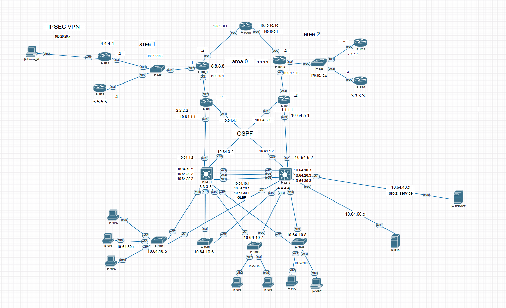

### Уровень доступа:

Настроим SVI на l3 свитчах, так же не забудем назанчить их как root primary для того, чтобы не было возможности у клиентов прервать стабильную работу протокола STP

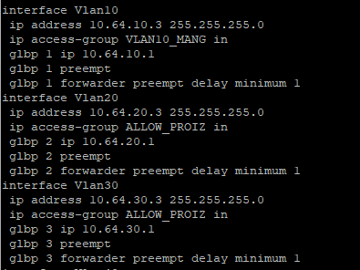
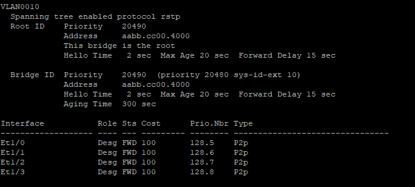
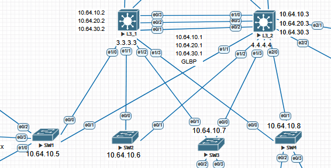

Сделаем базовую настройкую транк портов на интерфейсах, идущих к свитчам. Тоже самое сделаем на коммутаторах.
Так же на портах коммутатора, идущие к клиетам, настроим porfast и bpduguard. Первое нужно для того, чтобы не тратить время на прохождение всех этапов stp на портах, на которых нет устройств сети, кроме клиентов.
Второе нужно для защиты STP от попыток подключение коммутатора клиента.

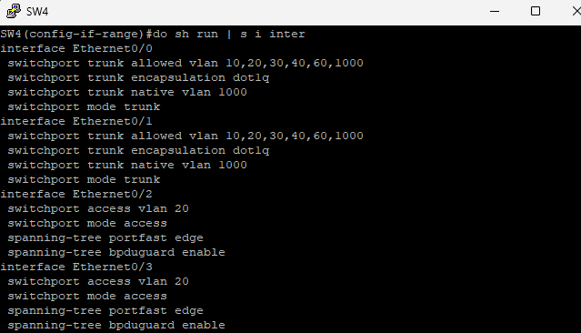

Настроим DHCP для того, чтобы наши клиенты могли использовать сервисы. Исключим адреса с последними двумя актетами 30.1-30.3 20.1-20.3 10.1-10.3, так как данные адреса будут использовать нашими L3 свитчам, для предоставления шлюза и сервера DHCP 

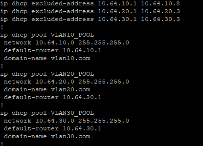
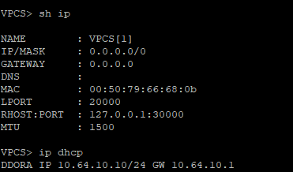

GLBP ( Gateway Load Balancing Protocol). Данный протоколо позволяет резервировать дополнительный шлюз для улучшения отказоустойчивости сети, а так же позволяет балансировать траффик, проходящий через данные L3 свитчи

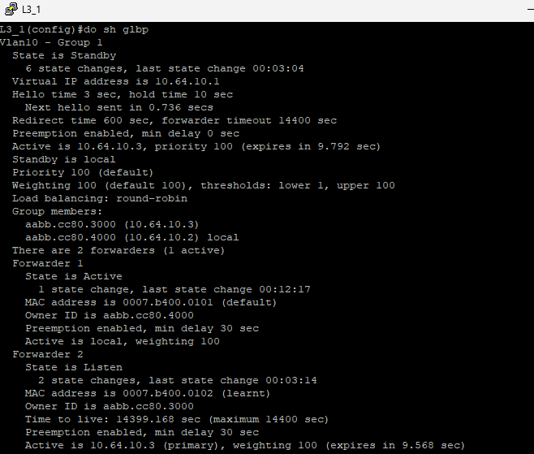
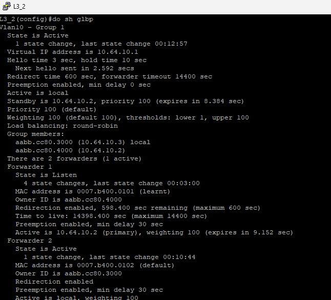

Режими работы: Round Robin , Weighted, Host dependent. Максимум 4 роутера

### Уровень распределения:

Агрегирование каналов связи. Мы настроим etherchannel L2, используя протокол PAgP. Почему L2? Потому что несмотря на то, что протокол GLBP использует IP адреса, он является протоколом L2. Поэтому для его стабильной работы ему нужно подобное соединение. 

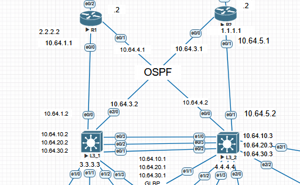
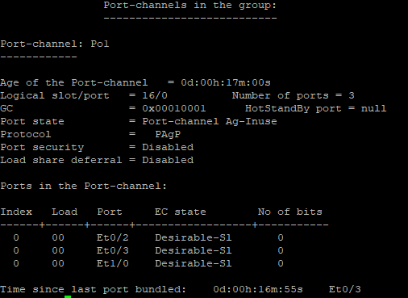
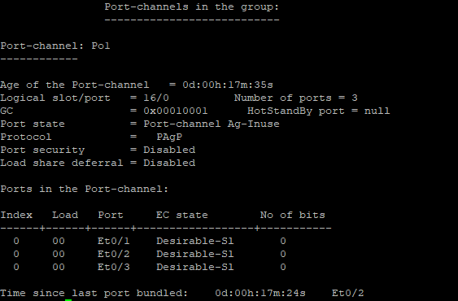

Это позволит увеличить скорость передачи данных на уровне распределения и повысит отказоустойчивость системы, ведь если один из портов упадёт, траффик будет всё ещё балансироваться между данными устройствами.

ACL 
Настроим два ACL( Access Control List) таким образом, чтобы хосты из влана 10 могли пинговать все маршрутизаторы и хосты внутри влана 10,
а в другом настроим так, чтобы хосты могли общаться внутри влана и общаться с сервисом 10.64.40.2.
Второй же сервис 10.64.60.2 будет закрыт для внутренних хостов, к нему можно получить доступ только изнутри.
Стоит так же заметить, что я прописываю разрешения для передачи пакетов dhcp и GLBP( ACL стоят на SVI), иначе данные протоколы не будут работать.

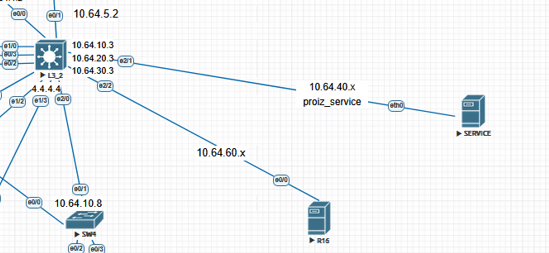
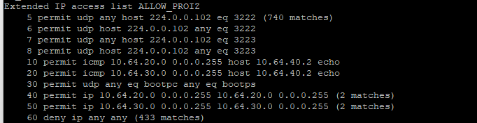
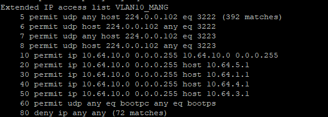

Пример пингов с хостов

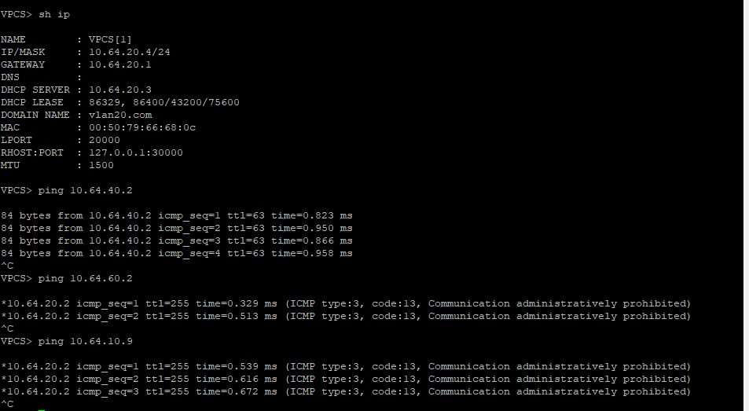
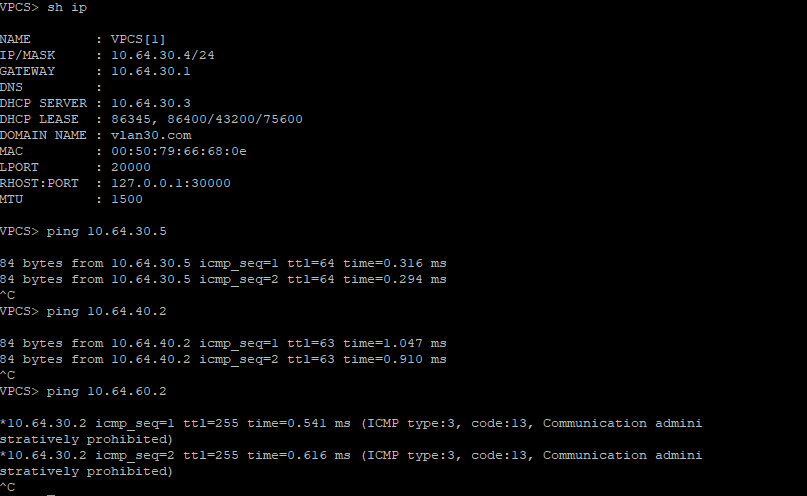
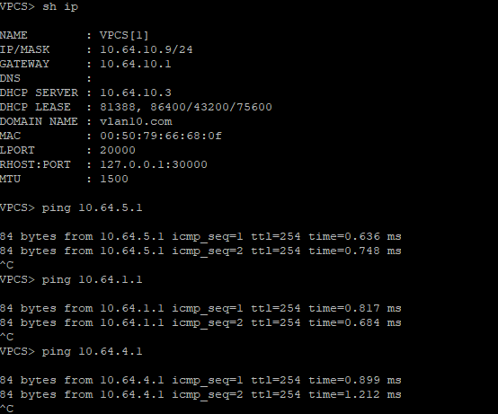

Настроим OSPF между всеми L3 устройствами для маршрутизации. Интерфейсы в сторону хостов настроем как passive-interface для того, чтобы объявлять их в сети, но при этом не посылать на них хэллоу пакеты OSPF.
Наша топология небольшая, так что мы не нуждаемся в использование продвинутых протоколов динамической маршрутизации, поэтому был выбран OSPF.

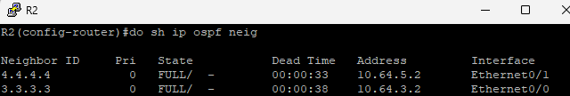
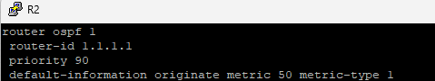
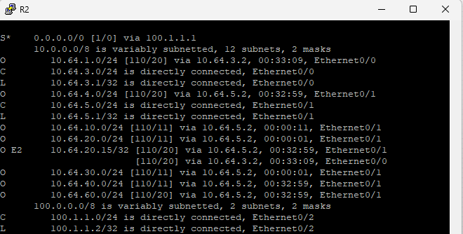

Static routing. На границе нашей сети с общей сети будет стоять маршрутизатор с настроенной статикой, чтобы в случае необходимость можно было бы подключится к сервису 10.64.60.2.

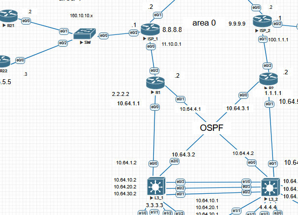
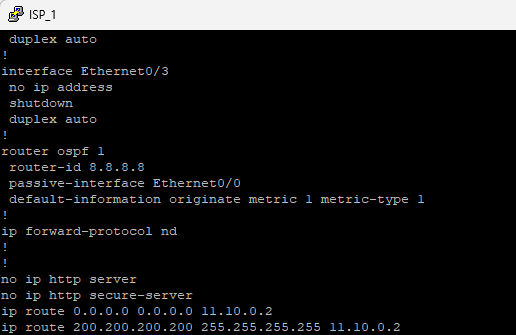

### Уровень ядра:

Отказоустойчивость. Для того, чтобы повысить отказоустойчивость, настроим на R1 IP Sla и Track. IP Sla - это инструмент для  активного тестирование соединения. Мы так же настроем слежение за ip sla 1, что позволит закрепить его за статическим маршрутом.
При падении интерфейса, статический маршрут пропадёт из таблицы маршрутизации, тем самым траффик пойдёт через R2.

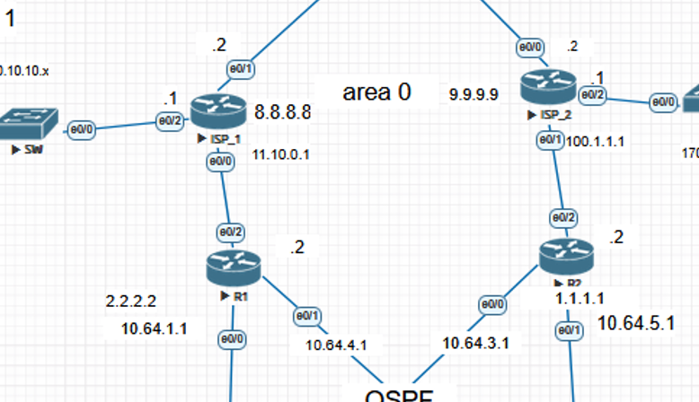
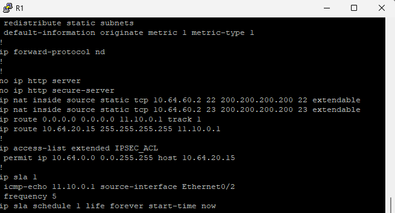
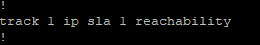

Пример того, как это выглядит: 

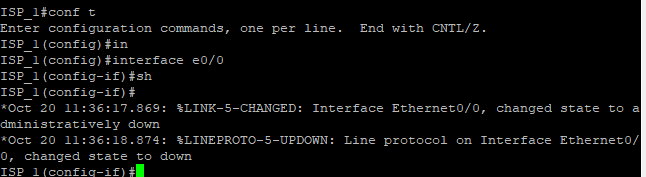
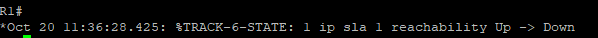
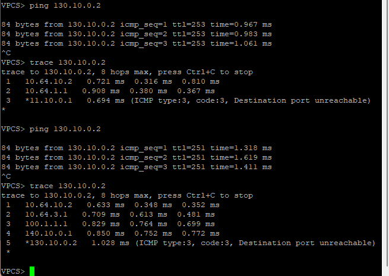

NAT. Настроим NAT для того, чтобы закрыть сервис 10.64.60.2 за ip 200.200.200.200 порт 23 (telnet)

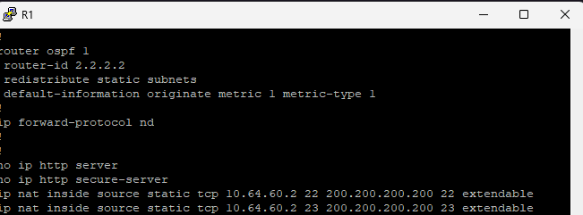
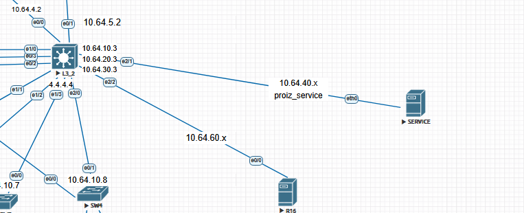

Таблица NAT translations:

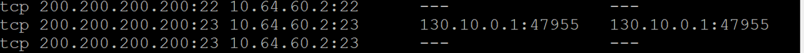

Попробуем подключится по telnet к данному сервису:

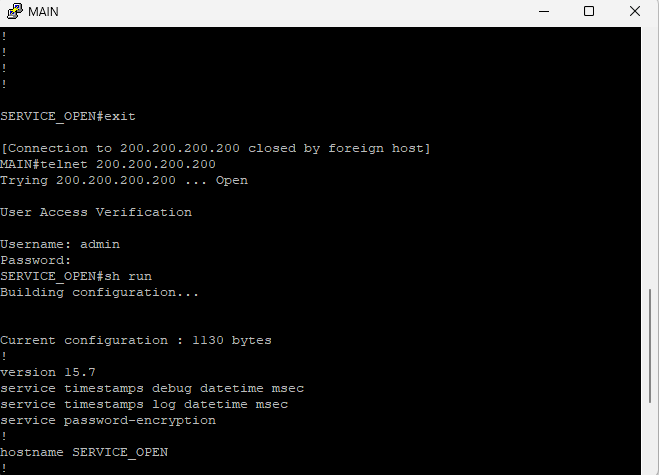

### IPSEC 
Туннель идёт от роутера R21 до R1.
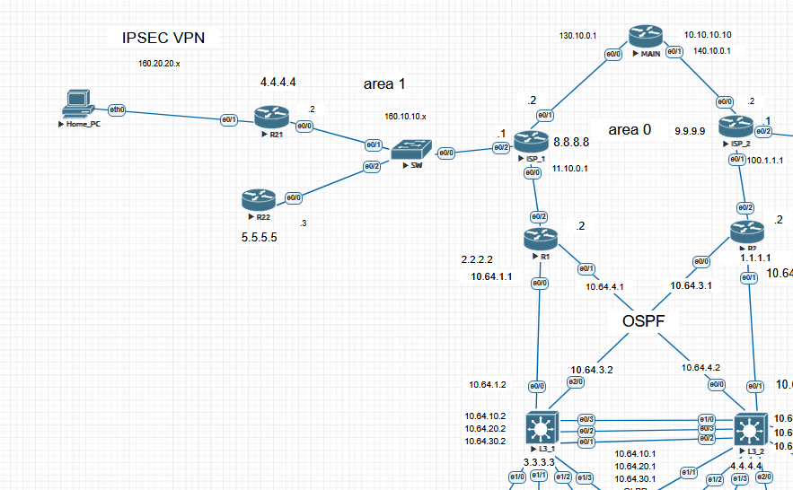

Для того чтобы настроить IPsec нам нужно сделать несколько шагов 
+ Настроить политику IKE Phase 1.
+ Задать общий ключ для аутентификации
+ Создать набор преобразований для IPSec.
+ Определить, какой трафик нужно защищать, с помощью списка доступа.
+ Создать карту криптографии и связать её с удаленным устройством, набором преобразований и списком доступа.

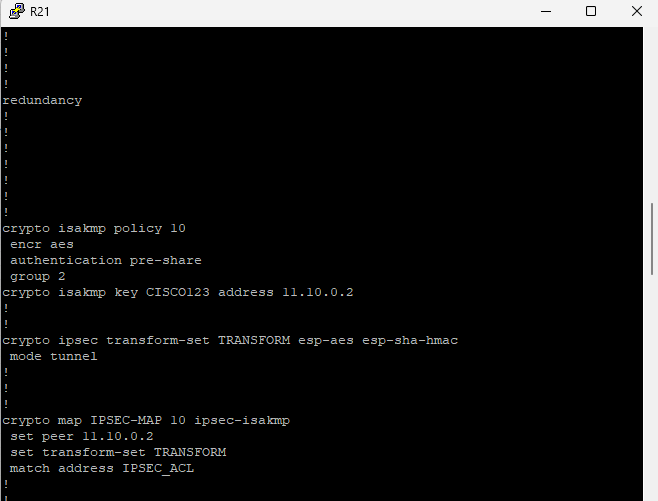

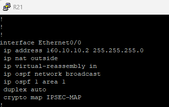

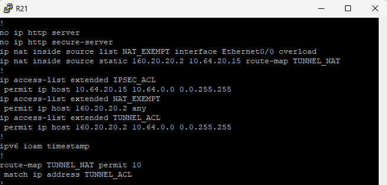

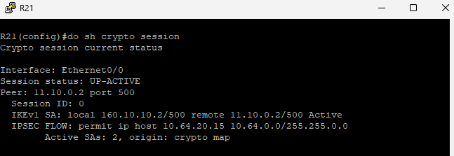

Хочу заметить, что траффик хоста 160.20.20.2 подвергается NAT когда идёт через туннель, когда пакеты идут в офис, если же траффик идёт просто в сеть, он подвергается PAT( вариация NAT, когда ip хоста заменяется на ip интерфейса маршрутизатора + порт)

Пример работы туннеля: 

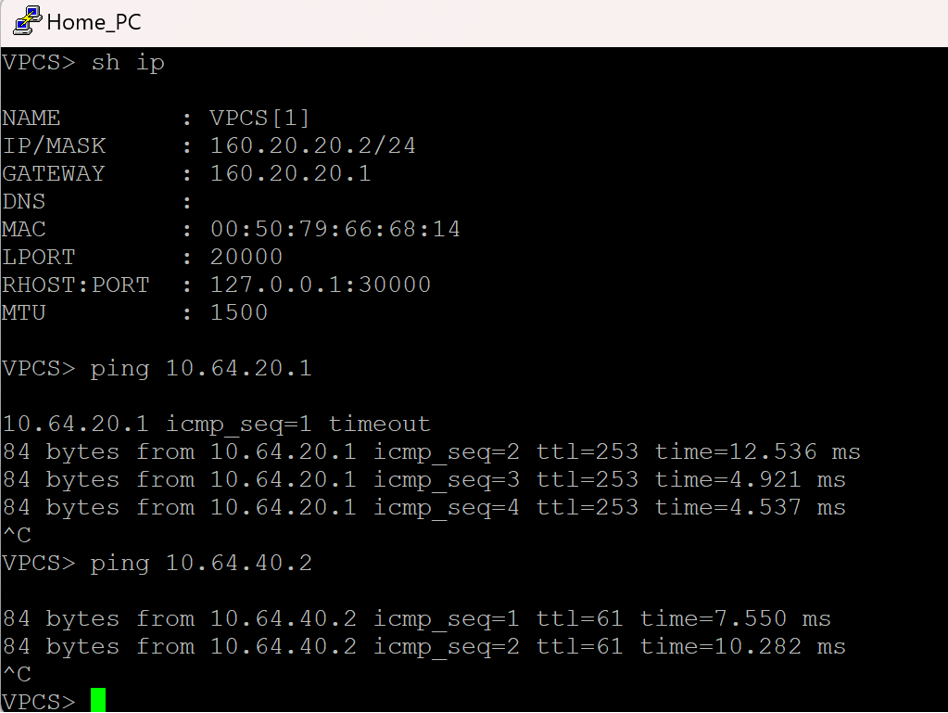
### Выводы
